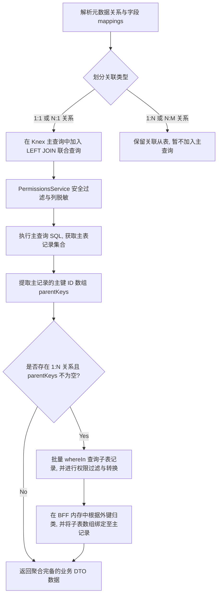

# Lumina 企业级低代码平台 - 系统架构与设计文档 (Architecture & Design)

## 1. 总体架构设计

Lumina 平台基于 **Node.js + NestJS + TypeScript** 技术栈开发。系统通过配置元数据库（`config.db`）来控制业务数据库（`business.db`）的动态联表查询、列级权限过滤，并使用基于双向链表的零侵入工作流引擎驱动业务生命周期。

### 1.1 系统架构图

```mermaid
graph TD
    subgraph Frontend [Lumina Vue 3 前端]
        Vue[Vue 应用] --> Router[路由管理器]
        Vue --> ModulesView[元数据模型配置/列级权限控制]
        Vue --> WorkflowView[审批流设计/单据流转面板]
    end

    subgraph Backend [Lumina Server 后端 - NestJS 11]
        API[API 控制器层] --> EngineCtrl[EngineController 动态查询入口]
        API --> PermsCtrl[PermissionsController 权限规则接口]
        API --> WorkflowCtrl[WorkflowController 工作流接口]
        
        Service[业务逻辑层] --> EngineService[EngineService 动态混合查询引擎]
        Service --> PermsService[PermissionsService 列级权限解析]
        Service --> WorkflowService[WorkflowService v2 审批流引擎]
        
        DB[数据访问层] --> DBService[DatabaseService / Knex.js]
    end

    subgraph Storage [SQLite 数据库]
        ConfigDB[(配置数据库 config.db)]
        BusinessDB[(业务数据库 business.db)]
    end

    %% 核心数据与流向关系
    Vue -->|HTTP 请求| API
    EngineService -->|1. 获取表与字段定义| ConfigDB
    EngineService -->|2. 加载列级只读或遮罩规则| PermsService
    EngineService -->|3. 执行物理 SQL 及 1:N/N:M BFF 内存拼接| BusinessDB
    PermsService -->|读取角色及字段权限| ConfigDB
    WorkflowService -->|配置、实例与任务读写| ConfigDB
    WorkflowService -->|审批完结抛出事件| EventEmitter[@nestjs/event-emitter]
    EventEmitter -->|订阅并物理执行业务变更| BusinessModule[业务表变更模块]
```

---

## 2. 数据库详细设计 (SQLite Schema)

数据库划分为**系统配置库 (`config.db`)**与**业务库 (`business.db`)**，实现配置与数据的物理隔离。

### 2.1 系统配置数据库 (`config.db`)

#### 2.1.1 元数据建模表
1. **`module_meta` (模块定义表)**：
   - `id` (VARCHAR(64), PK): 模块标识（如 `'order'`）。
   - `name`, `description`: 模块描述。
2. **`datasource_meta` (数据源表)**：
   - `id` (INTEGER, PK, AUTOINCREMENT)
   - `name` (VARCHAR(64), UNIQUE), `db_type` (VARCHAR(16) - 如 `'SQLITE'`, `'MYSQL'`), `host`, `port`, `schema_name`, `username`, `password_enc`.
3. **`table_meta` (物理表注册定义表)**：
   - `id` (INTEGER, PK, AUTOINCREMENT)
   - `datasource_id` (INTEGER, FK): 关联数据源。
   - `table_name` (VARCHAR(64)), `display_name` (VARCHAR(128)), `primary_column` (VARCHAR(64)).
4. **`module_table_meta` (模块表绑定关系表)**：
   - `module_id` (VARCHAR(64), FK), `table_meta_id` (INTEGER, FK), `sort_order` (INTEGER).
5. **`field_meta` (字段定义表)**：
   - `id` (INTEGER, PK, AUTOINCREMENT)
   - `table_meta_id` (INTEGER, FK): 归属的表元数据 ID。
   - `column_name` (VARCHAR(64)): 物理列名。
   - `label` (VARCHAR(64)): 物理列显示标签。
   - `data_type` (VARCHAR(32)): 字段数据类型（`NUMBER`, `STRING`, `DECIMAL`, `DATETIME`）。
6. **`relation` (表关系定义表)**：
   - `id` (INTEGER, PK, AUTOINCREMENT)
   - `name` (VARCHAR(64)): 关系名称。
7. **`relation_field_meta` (关系字段映射表 - 用于解析 1:N / N:M 关联)**：
   - `relation_id` (INTEGER, FK)
   - `field_meta_id` (INTEGER, FK): 物理字段 ID。
   - `cardinality` (VARCHAR(1)): 基数属性（`'1'` 表示主键端，`'N'` 表示外键端）。

#### 2.1.2 Unix 类风格字段权限表
1. **`role` (系统角色表)**：
   - `code` (VARCHAR(64), UNIQUE, PK): 角色代码（如 `'admin'`, `'editor'`, `'viewer'`）。
   - `name` (VARCHAR(128)): 角色名称。
2. **`field_permission` (字段权限分配表)**：
   - `field_meta_id` (INTEGER, FK): 物理字段 ID。
   - `role_code` (VARCHAR(64)): 关联角色。
   - `perm_value` (INTEGER): 位掩码权限值（类 Unix 权限模式，例如 `4` 为 READ 只读，`7` 为完全读写控制，未配置的字段默认无访问权限 - Whitelist 模式）。

#### 2.1.3 审批流核心引擎表
1. **`sys_approval_chain_config` (审批链配置表)**：
   - `id` (INTEGER, PK, AUTOINCREMENT)
   - `module_id` (VARCHAR(50)): 关联业务模块。
   - `up_id` (INTEGER): 前驱节点指针。
   - `next_id` (INTEGER): 后置节点指针（`0` 代表终点）。
   - `node_type` (VARCHAR(50)): 节点类型（`'user_task'` 或 `'parallel_group'`）。
   - `role_target` (VARCHAR(50)): 审批角色目标。
   - `parallel_branches` (TEXT/JSON): 并联分支配置（如 `[{"branch_id":"b1","name":"教务处核准","role_target":"academic_admin"}]`）。
   - `re_approval_strategy` (VARCHAR(50)): 回退机制（`'strict_reset'` 严格重审, `'smart_rollback'` 智能靶向回退）。
2. **`sys_approval_instance` (统一流程实例表)**：
   - `business_no` (VARCHAR(50), PK): 统一流水单号。
   - `module_id` (VARCHAR(50)): 关联模块。
   - `target_entity` (VARCHAR(100)): 物理业务表名。
   - `target_record_id` (VARCHAR(100)): 业务主键值。
   - `action_type` (VARCHAR(50)): 变更类型（`'INSERT'`, `'UPDATE'`, `'DELETE'`, `'CUSTOM'`）。
   - `payload` (TEXT/JSON): 暂存的业务草稿/变更明细。
   - `macro_status` (INTEGER): 宏观状态（`1` 审批中, `99` 终审生效, `-99` 驳回作废）。
3. **`sys_approval_task` (运行任务表)**：
   - `id` (INTEGER, PK, AUTOINCREMENT)
   - `business_no` (VARCHAR(50), FK): 关联实例。
   - `node_id` (INTEGER): 对应的审批配置节点。
   - `branch_id` (VARCHAR(50)): 并联分支 ID（非并行组时为空）。
   - `status` (VARCHAR(50)): 任务状态（`'PENDING'`, `'PASS'`, `'REJECT'`, `'INVALIDATED'`）。
4. **`sys_approval_log` (审批流执行日志表)**：
   - 记录每次审批的操作类型、操作人、备注说明与是否为系统回退日志（`is_system`）。

---

### 2.2 业务数据库 (`business.db`)

包含核心业务实体表，其数据结构完全不包含任何工作流的标识字段：
1. **`orders` (订单主表)**：
   - `id` (INTEGER, PK, AUTOINCREMENT), `order_no`, `customer_id` (外键), `amount` (金额), `status` (订单物理状态，如 `'PAID'`, `'SHIPPED'`), `remark`.
2. **`order_items` (订单明细从表 - 1:N 关系)**：
   - `id`, `order_id` (外键关联 orders), `product_name`, `qty`, `price`.
3. **`customer_profiles` (客户扩展表 - N:1 关系)**：
   - `id` (PK), `name`, `level`, `contact_phone`.
4. **`tags` (标签主表 - 多对多关系右表)**：
   - `id` (PK), `name`.
5. **`order_tags` (多对多关联中间表)**：
   - `id`, `order_id`, `tag_id`.

---

## 3. 核心设计与数据流转逻辑

### 3.1 动态关联查询与组装算法 (1:1 / 1:N / N:M)

动态查询引擎 `EngineService` 接收低代码查询配置，其核心组装逻辑为：



- **N:M 多对多的链式拼接**：引擎通过解析 `orders-order_tags` (1:N) 与 `tags-order_tags` (1:N) 两重 1:N 映射关系。先通过主表主键批量查询 `order_tags` 关联关系，再通过 `tag_id` 集合批量查询 `tags` 表，最终在内存中将 `tags` DTO 数组渲染到对应的 `orders` 记录下。

---

### 3.2 零侵入工作流生命周期契约

在 Node.js 中，业务逻辑层与工作流引擎之间保持绝对边界，采用 `EventEmitter2` 驱动的闭环模式：

```
+---------------+                              +-----------------+
| 业务控制层/前端 |                              |  工作流引擎      |
+---------------+                              +-----------------+
        |                                               |
        |---- 1. 提交申请(action_type, payload) ------->|
        |                                               |-- 2. 创建 sys_approval_instance
        |                                               |   (将业务草稿 payload 序列化存储)
        |                                               |-- 3. 创建首个节点的 PENDING 任务
        |<--- 4. 返回 business_no ----------------------|
        |                                               |
  (审批处理中)                                           |
        |                                               |
        |---- 5. 审批人同意 handleTask(PASS) ---------->|
        |                                               |-- 6. 标记 task 为 PASS
        |                                               |-- 7. 检查 parallel_group 汇聚完成
        |                                               |-- 8. 流程完结 (next_id = 0)
        |                                               |   更新 macro_status = 99
        |<--- 9. 抛出 workflow.process.approved.MOD ----| (EventEmitter2)
        |
+--------------------------+
| 业务系统监听器 (Listener) |
+--------------------------+
        |
        |-- 10. 接收解密后的最终 payload
        |-- 11. 物理写入真实业务表 (orders/items)
        |   (流程闭环)
```

---

## 4. 核心系统开发规范

1. **Knex 事务规范**：
   工作流操作（任务通过/驳回、日志写入、智能靶向回退）涉及对 `sys_approval_task`、`sys_approval_log` 等多张表的操作，必须在 `configDb.transaction()` 中执行，保证状态转换的原子性。
2. **列级权限安全白名单**：
   在拼接 SQL 和输出 DTO 时，必须始终通过 `PermissionsService` 校验，未在 `field_permission` 中为用户角色配置的字段一律在选择阶段排除，防止越权读取。
3. **数据变更策略**：
   回退类型设为 `'smart_rollback'` 时，发生数据变更则仅作废变更字段涉及的并行分支节点任务（状态改为 `'INVALIDATED'`），并重新激活该分支任务（`'PENDING'`），确保协同审批体验。
