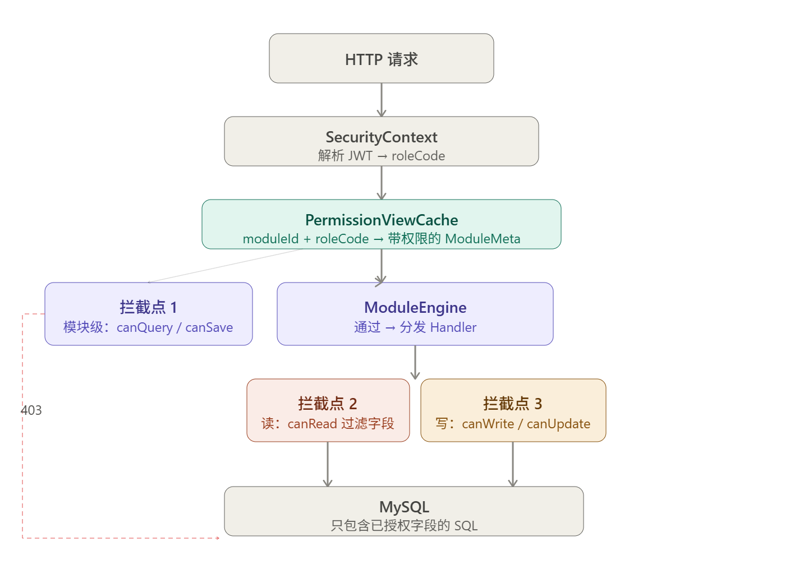

好的，这是一个典型的**字段级权限**问题，需要在现有方案上增加一个权限拦截层。先梳理清楚设计思路，再给出代码。

## 核心设计思路

权限控制需要解决三个问题：**谁**（角色/用户）对**哪个模块的哪张表的哪个字段**有**什么操作**（读/写/更新）的权限。这天然是一个三维矩阵，用一张权限表来存储，查询时做交集过滤。

---

## 一、数据库扩展

在原有元数据表基础上，新增权限相关表。

```sql
-- 角色表
CREATE TABLE sys_role (
    id          BIGINT PRIMARY KEY AUTO_INCREMENT,
    code        VARCHAR(64) UNIQUE NOT NULL,  -- 如 "admin" "editor" "viewer"
    name        VARCHAR(128)
);

-- 字段级权限表（核心）
-- 粒度：角色 + 模块 + 表 + 字段 + 操作类型
CREATE TABLE field_permission (
    id            BIGINT PRIMARY KEY AUTO_INCREMENT,
    role_code     VARCHAR(64) NOT NULL,
    module_id     VARCHAR(64) NOT NULL,
    table_meta_id BIGINT NOT NULL,
    field_meta_id BIGINT NOT NULL,       -- NULL 表示对整张表生效（快捷配置）
    can_read      TINYINT(1) DEFAULT 0,
    can_write     TINYINT(1) DEFAULT 0,  -- 新增时可写
    can_update    TINYINT(1) DEFAULT 0,  -- 更新时可写
    INDEX idx_role_module (role_code, module_id)
);

-- 模块级权限表（粗粒度，可选）
-- 控制某角色是否能访问整个模块（在字段级之上的快速拦截）
CREATE TABLE module_permission (
    id          BIGINT PRIMARY KEY AUTO_INCREMENT,
    role_code   VARCHAR(64) NOT NULL,
    module_id   VARCHAR(64) NOT NULL,
    can_query   TINYINT(1) DEFAULT 0,
    can_save    TINYINT(1) DEFAULT 0,
    can_delete  TINYINT(1) DEFAULT 0,
    UNIQUE KEY uk_role_module (role_code, module_id)
);
```

---

## 二、元数据模型扩展

在 `FieldMeta` 上挂载当前请求上下文中解析好的权限快照，避免每次都重新查库。

```java
@Data
public class FieldMeta {
    private Long    id;
    private String  columnName;
    private String  alias;
    private boolean queryable;
    private boolean sortable;
    private String  queryOp;
    private String  dataType;

    // 新增：运行时权限快照（从 field_permission 解析后填入）
    private boolean canRead;
    private boolean canWrite;
    private boolean canUpdate;
}

@Data
public class ModuleMeta {
    private String          id;
    private String          name;
    private TableMeta       mainTable;
    private List<TableMeta> subTables;
    private List<TableMeta> joinTables;
    private List<TableMeta> listTables;
    private List<RelationMeta> relations;

    // 新增：模块级权限
    private boolean canQuery;
    private boolean canSave;
    private boolean canDelete;
}
```

---

## 三、权限解析层

权限解析的关键是：**在元数据加载完成后，叠加当前角色的权限配置**，生成一个"带权限的元数据视图"。

```java
@Component
@RequiredArgsConstructor
public class PermissionResolver {

    private final DSLContext dsl;

    /**
     * 为当前角色解析模块权限，返回带权限快照的 ModuleMeta 副本
     * 原始 ModuleMeta 不修改（缓存中的对象不能被污染）
     */
    public ModuleMeta resolve(ModuleMeta meta, String roleCode) {
        // 深拷贝，避免污染缓存中的原始对象
        ModuleMeta view = deepCopy(meta);

        // 1. 加载模块级权限
        applyModulePermission(view, roleCode);

        // 2. 加载字段级权限，按 field_meta_id 建索引
        Map<Long, FieldPermission> permMap =
            loadFieldPermissions(meta.getId(), roleCode);

        // 3. 遍历所有表的所有字段，打上权限标记
        allTables(view).forEach(table ->
            table.getFields().forEach(field -> {
                FieldPermission perm = permMap.get(field.getId());
                if (perm != null) {
                    field.setCanRead(perm.isCanRead());
                    field.setCanWrite(perm.isCanWrite());
                    field.setCanUpdate(perm.isCanUpdate());
                } else {
                    // 没有配置权限记录 → 默认全部拒绝（白名单模式）
                    field.setCanRead(false);
                    field.setCanWrite(false);
                    field.setCanUpdate(false);
                }
            })
        );

        return view;
    }

    private void applyModulePermission(ModuleMeta view, String roleCode) {
        var perm = dsl.selectFrom(DSL.table("module_permission"))
            .where(DSL.field("role_code").eq(roleCode)
               .and(DSL.field("module_id").eq(view.getId())))
            .fetchOneInto(ModulePermission.class);

        if (perm == null) {
            view.setCanQuery(false);
            view.setCanSave(false);
            view.setCanDelete(false);
        } else {
            view.setCanQuery(perm.isCanQuery());
            view.setCanSave(perm.isCanSave());
            view.setCanDelete(perm.isCanDelete());
        }
    }

    private Map<Long, FieldPermission> loadFieldPermissions(
            String moduleId, String roleCode) {
        return dsl.selectFrom(DSL.table("field_permission"))
            .where(DSL.field("module_id").eq(moduleId)
               .and(DSL.field("role_code").eq(roleCode)))
            .fetchInto(FieldPermission.class)
            .stream()
            .collect(Collectors.toMap(FieldPermission::getFieldMetaId,
                                      p -> p));
    }

    private List<TableMeta> allTables(ModuleMeta meta) {
        List<TableMeta> all = new ArrayList<>();
        if (meta.getMainTable() != null) all.add(meta.getMainTable());
        if (meta.getSubTables()  != null) all.addAll(meta.getSubTables());
        if (meta.getJoinTables() != null) all.addAll(meta.getJoinTables());
        if (meta.getListTables() != null) all.addAll(meta.getListTables());
        return all;
    }
}
```

---

## 四、权限视图缓存

原始元数据按 `moduleId` 缓存，权限视图按 `moduleId + roleCode` 缓存，二者独立。

```java
@Component
@RequiredArgsConstructor
public class PermissionViewCache {

    private final MetaCache        metaCache;
    private final PermissionResolver resolver;

    // 权限视图缓存：key = "moduleId:roleCode"，5 分钟过期
    // 比元数据缓存（1小时）短，权限变更要更及时生效
    private final Cache<String, ModuleMeta> permCache = Caffeine.newBuilder()
        .maximumSize(5000)   // 模块数 × 角色数
        .expireAfterWrite(5, TimeUnit.MINUTES)
        .build();

    public ModuleMeta getWithPermission(String moduleId, String roleCode) {
        String key = moduleId + ":" + roleCode;
        return permCache.get(key, k -> {
            ModuleMeta raw = metaCache.get(moduleId);
            return resolver.resolve(raw, roleCode);
        });
    }

    // 修改权限后主动失效
    public void invalidate(String moduleId, String roleCode) {
        permCache.invalidate(moduleId + ":" + roleCode);
    }

    public void invalidateModule(String moduleId) {
        // 失效某模块下所有角色的权限视图
        permCache.asMap().keySet().stream()
            .filter(k -> k.startsWith(moduleId + ":"))
            .forEach(permCache::invalidate);
    }
}
```

---

## 五、权限拦截点

权限检查分布在三个位置，形成纵深防御：

```java
// ── 1. 模块引擎入口：模块级权限拦截 ──────────────────────────────
@Service
@RequiredArgsConstructor
public class ModuleEngine {

    private final PermissionViewCache permViewCache;
    private final ListHandler         listHandler;
    private final DetailHandler       detailHandler;
    private final RelationHandler     relationHandler;
    private final DSLContext          dsl;

    public Map<String, Object> query(String moduleId, QueryRequest req) {
        String roleCode = SecurityContext.currentRoleCode();
        ModuleMeta meta = permViewCache.getWithPermission(moduleId, roleCode);

        // 模块级拦截
        if (!meta.isCanQuery()) {
            throw new AccessDeniedException("无权访问模块：" + moduleId);
        }

        // 后续逻辑不变，但传入的 meta 已经带有字段级权限标记
        Map<String, Object> result = new LinkedHashMap<>();
        meta.getListTables().forEach(t ->
            result.put(t.getAlias(), listHandler.query(t, req)));

        if (req.getId() != null) {
            result.put("detail",
                detailHandler.query(meta.getMainTable(),
                                    meta.getJoinTables(), req.getId()));
            meta.getRelations().forEach(rel ->
                result.put(rel.getName(),
                    relationHandler.queryRight(rel, req.getId())));
        }
        return result;
    }

    @Transactional(rollbackFor = Exception.class)
    public Long save(String moduleId, SaveRequest req) {
        String roleCode = SecurityContext.currentRoleCode();
        ModuleMeta meta = permViewCache.getWithPermission(moduleId, roleCode);

        if (!meta.isCanSave()) {
            throw new AccessDeniedException("无权写入模块：" + moduleId);
        }
        // ... 后续 upsert 逻辑
    }
}
```

```java
// ── 2. DynamicQueryBuilder：读取时过滤无权字段 ───────────────────
public SelectSeekStepN<Record> buildListQuery(TableMeta table,
                                               QueryRequest req) {
    Table<Record> t = DSL.table(DSL.name(table.getTableName()))
                          .as(table.getAlias());

    // 只 SELECT canRead=true 的字段（权限已在 PermissionResolver 中打标）
    List<Field<?>> selectFields = table.getFields().stream()
        .filter(FieldMeta::isCanRead)          // ← 权限过滤
        .map(f -> DSL.field(DSL.name(table.getAlias(), f.getColumnName()))
                     .as(f.getAlias()))
        .collect(toList());

    if (selectFields.isEmpty()) {
        throw new AccessDeniedException(
            "表 [" + table.getTableName() + "] 无任何可读字段");
    }

    return dsl.select(selectFields)
              .from(t)
              .where(buildConditions(table, req.getFilters()))
              .orderBy(/* ... */);
}
```

```java
// ── 3. ModuleEngine.upsertTable：写入时过滤无权字段 ──────────────
private Long upsertTable(TableMeta table, Map<String, Object> data,
                          Long id, boolean isInsert) {
    Table<Record> t = DSL.table(DSL.name(table.getTableName()));

    Map<Field<?>, Object> fieldMap = new LinkedHashMap<>();
    data.forEach((alias, val) -> {
        FieldMeta fm = table.getFieldByAlias(alias);
        if (fm == null) return;

        // 新增 vs 更新用不同权限位
        boolean allowed = isInsert ? fm.isCanWrite() : fm.isCanUpdate();
        if (!allowed) {
            // 静默忽略无权字段，不报错（防止前端泄露字段存在性）
            return;
        }
        fieldMap.put(DSL.field(DSL.name(fm.getColumnName())), val);
    });

    if (fieldMap.isEmpty()) {
        throw new AccessDeniedException(
            "表 [" + table.getTableName() + "] 无任何可写字段");
    }

    if (isInsert) {
        return dsl.insertInto(t).set(fieldMap)
                  .returningResult(DSL.field("id", Long.class))
                  .fetchOne().value1();
    } else {
        dsl.update(t).set(fieldMap)
           .where(DSL.field("id").eq(id)).execute();
        return id;
    }
}
```

---

## 六、SecurityContext 封装

```java
// 从 Spring Security 或 JWT 中取当前角色，集中管理
public class SecurityContext {

    public static String currentRoleCode() {
        Authentication auth = org.springframework.security.core.context
            .SecurityContextHolder.getContext().getAuthentication();
        if (auth == null) throw new UnauthorizedException("未登录");

        // 取第一个角色（多角色场景可扩展为取权限并集）
        return auth.getAuthorities().stream()
            .map(GrantedAuthority::getAuthority)
            .filter(a -> a.startsWith("ROLE_"))
            .map(a -> a.substring(5).toLowerCase())
            .findFirst()
            .orElseThrow(() -> new AccessDeniedException("无角色信息"));
    }
}
```

---

## 七、整体数据流

下面这张图展示权限在整个请求链路中的拦截位置：



## 八、多角色权限合并

实际场景中一个用户可能同时有多个角色（如 `editor` + `viewer`），权限取**并集**：

```java
public ModuleMeta resolveMultiRole(ModuleMeta meta,
                                    List<String> roleCodes) {
    if (roleCodes.size() == 1) {
        return resolve(meta, roleCodes.get(0));
    }

    // 分别解析每个角色的视图，然后合并
    List<ModuleMeta> views = roleCodes.stream()
        .map(r -> resolve(meta, r))
        .toList();

    return mergeViews(views);
}

private ModuleMeta mergeViews(List<ModuleMeta> views) {
    ModuleMeta merged = deepCopy(views.get(0));

    // 模块级权限：任一角色有权限即可（OR 合并）
    merged.setCanQuery(views.stream().anyMatch(ModuleMeta::isCanQuery));
    merged.setCanSave (views.stream().anyMatch(ModuleMeta::isCanSave));
    merged.setCanDelete(views.stream().anyMatch(ModuleMeta::isCanDelete));

    // 字段级权限：同样 OR 合并
    allTables(merged).forEach(table ->
        table.getFields().forEach(field -> {
            String alias = field.getAlias();
            field.setCanRead(views.stream().anyMatch(v ->
                getField(v, table.getAlias(), alias).isCanRead()));
            field.setCanWrite(views.stream().anyMatch(v ->
                getField(v, table.getAlias(), alias).isCanWrite()));
            field.setCanUpdate(views.stream().anyMatch(v ->
                getField(v, table.getAlias(), alias).isCanUpdate()));
        })
    );
    return merged;
}
```

---

## 九、权限管理 API

```java
@RestController
@RequestMapping("/api/admin/permission")
@RequiredArgsConstructor
public class PermissionAdminController {

    private final DSLContext         dsl;
    private final PermissionViewCache permViewCache;

    // 批量设置字段权限（管理员配置界面调用）
    @PostMapping("/field/batch")
    @Transactional
    public Result setFieldPermissions(
            @RequestBody FieldPermissionBatchRequest req) {

        Table<Record> t = DSL.table("field_permission");

        // 先删除该角色在该模块的所有字段权限，再批量插入
        dsl.deleteFrom(t)
           .where(DSL.field("role_code").eq(req.getRoleCode())
              .and(DSL.field("module_id").eq(req.getModuleId())))
           .execute();

        var inserts = req.getPermissions().stream().map(p ->
            dsl.insertInto(t)
               .set(DSL.field("role_code"),     req.getRoleCode())
               .set(DSL.field("module_id"),     req.getModuleId())
               .set(DSL.field("table_meta_id"), p.getTableMetaId())
               .set(DSL.field("field_meta_id"), p.getFieldMetaId())
               .set(DSL.field("can_read"),      p.isCanRead())
               .set(DSL.field("can_write"),     p.isCanWrite())
               .set(DSL.field("can_update"),    p.isCanUpdate())
        ).toList();

        dsl.batch(inserts).execute();

        // 权限变更后立即失效相关缓存
        permViewCache.invalidateModule(req.getModuleId());

        return Result.ok();
    }
}
```

---

## 十、各层职责一览

| 层次 | 类 | 职责 |
|------|----|------|
| 数据层 | `field_permission` 表 | 存储角色×模块×字段×操作的权限矩阵 |
| 解析层 | `PermissionResolver` | 将权限记录叠加到 `ModuleMeta` 副本上 |
| 缓存层 | `PermissionViewCache` | `moduleId:roleCode` → 带权限视图，5 分钟 TTL |
| 拦截点 1 | `ModuleEngine` 入口 | 模块级 `canQuery` / `canSave` 快速拦截 |
| 拦截点 2 | `DynamicQueryBuilder` | `SELECT` 时过滤 `canRead=false` 的字段 |
| 拦截点 3 | `ModuleEngine.upsertTable` | 写入时区分 `canWrite`（新增）vs `canUpdate`（更新） |
| 失效入口 | `PermissionAdminController` | 权限变更后主动清除缓存 |

---

几个关键设计决策值得说明：

**深拷贝是必须的**。`PermissionResolver` 必须对 `ModuleMeta` 做深拷贝后再打权限标记，绝不能直接修改缓存中的原始对象，否则一个角色的权限会污染所有其他角色的视图。

**写入时静默忽略无权字段**，而不是抛出异常。前端可能传来整个表单数据，其中某些字段当前角色无权修改，静默丢弃比报错更合理，也避免泄露字段是否存在的信息。

**`canWrite` 和 `canUpdate` 分开设计**。新增和更新是两种操作，比如 `create_time`、`creator_id` 这类字段只在新增时可写，后续更新应禁止覆盖，两个权限位能精确表达这一语义。