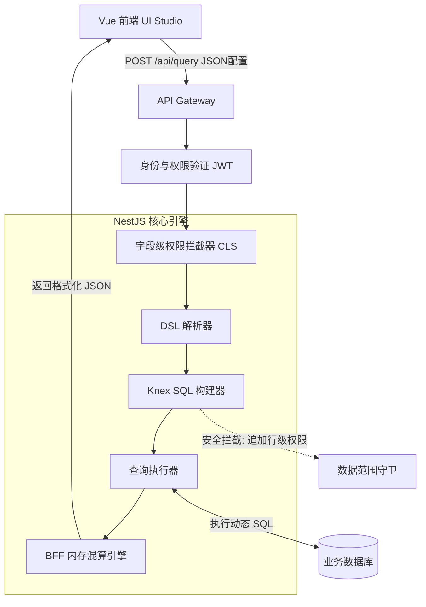

# 动态投影与混合计算引擎后端架构方案 (Node.js + NestJS)

## 1. 架构总览
本系统采用**元数据驱动（Metadata-Driven）**的设计理念，实现高度动态化的字段映射与跨表关联。结合前后端分离的最佳实践，我们选用 Node.js (NestJS) + Knex.js 构建后端解析与执行引擎。

### 核心特性
*   **配置即查询**：前端仅传递 JSON 结构的 `mappings` 和 `entities`，由后端动态拼接安全的 SQL。
*   **混合计算 (Hybrid Engine)**：
    *   **DB 下推 (Push-down)**：依托底层数据库的索引与内置函数处理聚合、拼接（如 `CONCAT`, `DATE_FORMAT`）。
    *   **BFF 上拉 (Pull-up)**：将数据脱敏、字典翻译等轻量化、定制化逻辑放到 Node.js 内存中处理，减轻数据库压力。
*   **安全隔离**：原生支持行列级数据权限过滤（Row/Column-Level Security），彻底杜绝 SQL 注入。

## 2. 架构拓扑 (Mermaid)



## 3. 核心模块与伪代码实现

## 权限管理系统

### 权限API端点

#### 1. 设置全局权限配置
**POST** `/api/permissions/config`

请求体:
```json
{
  "permissions": [
    "hr_employee_base.emp_no.SELECT",
    "hr_employee_base.first_name.SELECT",
    "hr_payroll_result.net_amount.SELECT"
  ]
}
```

说明: 
- **默认不允许任何字段**
- 需要显式配置权限节点才能访问字段
- 如果 `permissions` 为空数组 `[]`，表示不允许任何字段

响应:
```json
{
  "success": true,
  "message": "成功设置 3 个权限节点",
  "permissionCount": 3
}
```

#### 2. 获取全局权限配置
**GET** `/api/permissions/config`

响应:
```json
{
  "success": true,
  "permissions": [
    "hr_employee_base.emp_no.SELECT",
    "hr_employee_base.first_name.SELECT"
  ],
  "permissionCount": 2,
  "status": "部分字段允许"
}
```

#### 3. 检查权限
**GET** `/api/permissions/check?entity=hr_employee_base&fieldName=emp_no&operationType=SELECT`

响应:
```json
{
  "success": true,
  "permissionNode": "hr_employee_base.emp_no.SELECT",
  "hasPermission": true
}
```

#### 4. 清空权限配置 (不允许任何字段)
**POST** `/api/permissions/clear`

响应:
```json
{
  "success": true,
  "message": "已清空权限配置，不允许任何字段"
}
```

### 权限拦截流程

1. **请求到达** - 用户发送查询请求
2. **权限检查** - `ColumnLevelSecurityInterceptor` 拦截请求
3. **字段过滤** - 根据全局权限配置过滤无权限的字段
4. **查询执行** - 修改后的配置传递给查询引擎
5. **结果返回** - 只返回有权限的字段

### 权限策略

#### 硬拦截 (推荐用于敏感数据)
直接过滤无权限的字段，不在查询中包含这些字段。

```typescript
config.mappings = this.permissionsService.filterMappingsByPermissions(
  config.mappings,
);
```

#### 软掩盖 (推荐用于部分可见数据)
保留字段但应用掩盖转换，显示为星号。

```typescript
config.mappings = this.permissionsService.applyPermissionTransformations(
  config.mappings,
);
```

### 权限节点格式

权限节点由三部分组成: `{entity}.{fieldName}.{operationType}`

- **entity**: 表名 (如 `hr_employee_base`)
- **fieldName**: 字段名 (如 `emp_no`)
- **operationType**: 操作类型 (`SELECT`, `UPDATE`, `WRITE`)

示例:
- `hr_employee_base.emp_no.SELECT` - 允许查询员工工号
- `hr_payroll_result.net_amount.SELECT` - 允许查询实发薪资
- `hr_employee_base.salary.UPDATE` - 允许更新薪资

### 使用示例

#### 前端调用 (Vue.js)

```javascript
// 设置权限配置
async function setPermissions(permissions) {
  const response = await fetch('/api/permissions/config', {
    method: 'POST',
    headers: { 'Content-Type': 'application/json' },
    body: JSON.stringify({ permissions })
  });
  return response.json();
}

// 获取权限配置
async function getPermissions() {
  const response = await fetch('/api/permissions/config');
  return response.json();
}

// 执行查询 (自动应用权限过滤)
async function executeQuery(moduleId) {
  const response = await fetch(`/api/query/${moduleId}`, {
    method: 'GET'
  });
  return response.json();
}
```

#### 权限配置示例

```javascript
// 不允许任何字段 (默认)
const noPermissions = [];

// HR部门 - 可查看所有员工信息
const hrPermissions = [
  'hr_employee_base.emp_no.SELECT',
  'hr_employee_base.first_name.SELECT',
  'hr_employee_base.last_name.SELECT',
  'hr_employee_base.status.SELECT',
  'hr_emp_job.emp_type.SELECT',
  'hr_organization.org_name.SELECT'
];

// 财务部 - 只能查看薪资信息
const financePermissions = [
  'hr_payroll_result.gross_amount.SELECT',
  'hr_payroll_result.net_amount.SELECT',
  'hr_payroll_result.payment_status.SELECT'
];

// 普通员工 - 只能查看自己的基本信息
const employeePermissions = [
  'hr_employee_base.emp_no.SELECT',
  'hr_employee_base.first_name.SELECT',
  'hr_employee_base.last_name.SELECT'
];
```

### 3.2 SQL 构建服务 (Knex Builder Service)
使用 Knex.js 纯函数式地拼接 `SELECT`, `FROM` 和按需的 `LEFT JOIN`。

```typescript
import { Injectable } from '@nestjs/common';
import { Knex } from 'knex';
import { InjectConnection } from 'nest-knexjs';

@Injectable()
export class QueryEngineService {
  constructor(@InjectConnection() private readonly knex: Knex) {}

  async executeDynamicQuery(config: any) {
    const { primaryEntity, entities, mappings } = config;
    const query = this.knex(primaryEntity.name);

    // 1. 收集使用到的物理表
    const usedEntities = new Set<string>();
    mappings.forEach(m => m.physicalFields?.forEach(pf => usedEntities.add(pf.entity)));

    // 2. 动态 LEFT JOIN (按需连表，消除冗余)
    entities.forEach(entity => {
      if (usedEntities.has(entity.name)) {
        query.leftJoin(
          entity.name,
          `${entity.name}.${entity.joinCondition.left}`,
          `${primaryEntity.name}.${entity.joinCondition.right}`
        );
      }
    });

    // 3. 构建 SELECT 字段
    const selectFields = new Set<string>();
    mappings.forEach(m => {
      if (m.transformerEnv === 'frontend') {
        // BFF 上拉：只查基础字段，不执行 SQL 计算
        m.physicalFields.forEach(pf => selectFields.add(`${pf.entity}.${pf.name}`));
      } else {
        // DB 下推：利用 DB 内置函数拼接
        if (m.transformer) {
          const rawSql = this.parseDbTransformer(m.transformer, m.physicalFields);
          query.select(this.knex.raw(`${rawSql} as ${m.logicalField}`));
        } else {
          const pf = m.physicalFields[0];
          query.select(`${pf.entity}.${pf.name} as ${m.logicalField}`);
        }
      }
    });

    // 将上拉需要用到的原始字段加入查询
    selectFields.forEach(field => query.select(field));

    // 行级数据权限 (RLS) 注入示例，底层拦截越权访问
    query.whereIn(`${primaryEntity.name}.dept_id`, [/* 用户管辖的 deptId 列表 */]);

    // 4. 执行查询
    const rawResults = await query;
    
    // 5. 交给 BFF 混算引擎进行二次计算
    return this.applyBffTransformers(rawResults, mappings);
  }
}
```

### 3.3 BFF 内存混算引擎 (Transformer Service)
拿到 DB 返回的扁平化基础数据后，遍历配置执行字典映射、脱敏等 JS 逻辑。

```typescript
applyBffTransformers(rows: any[], mappings: any[]) {
  // 注册全局业务字典与工具函数
  const contextFuncs = {
    DICT_MAP: (dictCode, value) => {
      const dictionary = { 
        'EMP_STATUS': { '1': '在职', '0': '离职' },
        'PAYMENT_STATUS': { '1': '已发放', '0': '未发放' }
      };
      return dictionary[dictCode]?.[value] || value;
    },
    FORMAT_CURRENCY: (value, currency) => `${currency} ${parseFloat(value).toFixed(2)}`,
    MASK_SENSITIVE: (value, type) => value ? value.replace(/(.{3}).*(.{4})/, '$1****$2') : '',
    ASSEMBLE_FRACTION: (current, max) => `${current} / ${max}`
  };

  return rows.map(row => {
    const finalRow = { ...row }; // 保留原始数据副本

    mappings.filter(m => m.transformerEnv === 'frontend').forEach(m => {
      // 简单正则提取函数名和参数进行动态执行，如 "DICT_MAP('EMP_STATUS', ${status})"
      const result = this.evaluateExpression(m.transformer, row, contextFuncs);
      finalRow[m.logicalField] = result;
    });

    return finalRow;
  });
}
```

## 4. 落地推进建议
1. **第一阶段 (Demo POC)：** 直接在 NestJS 中暴露 API，接收前端 Vue 传过来的 JSON 结构，利用 Knex 将真实 SQL 跑通。重点向业务方演示只需在前端托拉拽配置，即可完成复杂的跨表关联和混算。
2. **第二阶段 (MVP 构建)：** 加入 JWT 身份验证，硬编码实现简单的 Row-Level Security（部门权限）和 Column-Level Security（薪资脱敏）。将 `DICT_MAP` 等 BFF 逻辑抽象为标准 Provider 服务。
3. **第三阶段 (Production 交付)：** 彻底剥离前端传 JSON，将配置项全量入库管理（元数据驱动引擎）。接入企业级的微服务鉴权体系与正式的 Redis 分布式字典缓存，提供高性能的高并发报表导出能力。
