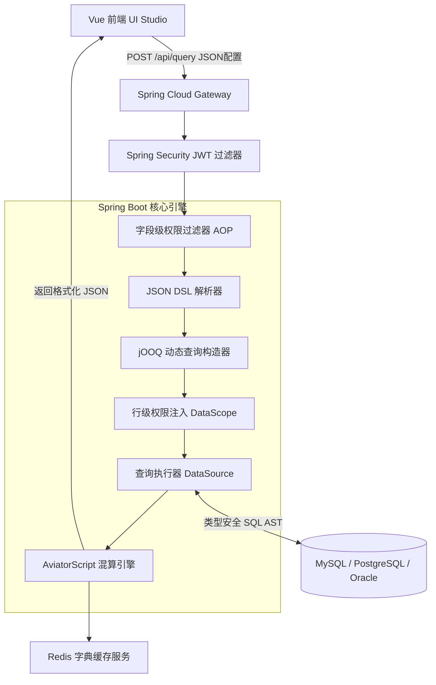

# 动态投影与混合计算引擎后端架构方案 (Java + Spring Boot + jOOQ)

## 1. 架构总览

本方案面向**大型国企、银行、等保合规场景**，采用 Java 生态成熟的企业级安全体系。通过 jOOQ 的类型安全 DSL 在运行时动态构造 SQL AST（抽象语法树），配合 AviatorScript 轻量级规则引擎处理 BFF 层混算逻辑，实现与 NestJS 方案等价的动态投影能力，但拥有更完备的审计合规和事务保障能力。

### 核心特性
*   **类型安全的动态 SQL**：使用 jOOQ DSL 构造 SQL AST，绝对防止 SQL 注入，且天然支持多数据库方言（MySQL / PostgreSQL / Oracle）。
*   **企业级安全体系**：可无缝对接 Spring Security + RBAC，内置 `@PreAuthorize` 注解实现接口级权限；结合 Apache ShardingSphere 实现数据库透明加密。
*   **表达式引擎集成**：引入 AviatorScript 执行 BFF 上拉的动态字符串规则，无需 JVM 重启即可热更新业务规则。
*   **事务与审计**：`@Transactional` 事务隔离 + Spring Data Auditing 自动记录数据变更轨迹。

## 2. 架构拓扑 (Mermaid)



## 3. Maven 依赖 (pom.xml)

```xml
<dependencies>
    <!-- Spring Boot Web + Validation -->
    <dependency>
        <groupId>org.springframework.boot</groupId>
        <artifactId>spring-boot-starter-web</artifactId>
    </dependency>
    <dependency>
        <groupId>org.springframework.boot</groupId>
        <artifactId>spring-boot-starter-validation</artifactId>
    </dependency>

    <!-- Spring Security (JWT) -->
    <dependency>
        <groupId>org.springframework.boot</groupId>
        <artifactId>spring-boot-starter-security</artifactId>
    </dependency>
    <dependency>
        <groupId>io.jsonwebtoken</groupId>
        <artifactId>jjwt-api</artifactId>
        <version>0.12.5</version>
    </dependency>

    <!-- jOOQ 动态 SQL 构造器 -->
    <dependency>
        <groupId>org.springframework.boot</groupId>
        <artifactId>spring-boot-starter-jooq</artifactId>
    </dependency>

    <!-- AviatorScript BFF 规则引擎 -->
    <dependency>
        <groupId>com.googlecode.aviator</groupId>
        <artifactId>aviator</artifactId>
        <version>5.4.3</version>
    </dependency>

    <!-- Redis 字典缓存 -->
    <dependency>
        <groupId>org.springframework.boot</groupId>
        <artifactId>spring-boot-starter-data-redis</artifactId>
    </dependency>

    <!-- Lombok + Jackson -->
    <dependency>
        <groupId>org.projectlombok</groupId>
        <artifactId>lombok</artifactId>
        <optional>true</optional>
    </dependency>
</dependencies>
```

## 4. 核心数据模型 (DSL 契约)

前端发送的 JSON 与 NestJS 方案完全一致，确保前端代码无需修改即可切换后端：

```java
// DSL 请求体 (对应 mockStore.js 的配置结构)
@Data
public class QueryConfigDTO {
    private PrimaryEntity primaryEntity;
    private List<EntityConfig> entities;
    private List<MappingConfig> mappings;

    @Data
    public static class PrimaryEntity {
        private String name;  // e.g. "hr_employee_base"
        private String desc;
    }

    @Data
    public static class EntityConfig {
        private String id;
        private String name;
        private JoinCondition joinCondition;

        @Data
        public static class JoinCondition {
            private String left;   // 关联表字段
            private String right;  // 主表字段
        }
    }

    @Data
    public static class MappingConfig {
        private String displayName;
        private String logicalField;
        private List<PhysicalField> physicalFields;
        private String transformer;         // null / "CONCAT(${a},'-',${b})"
        private String transformerEnv;      // "none" / "backend" / "frontend"

        @Data
        public static class PhysicalField {
            private String entity;
            private String name;
        }
    }
}
```

## 5. 核心模块实现

### 5.1 字段级权限过滤器 (AOP 切面)

```java
@Aspect
@Component
@RequiredArgsConstructor
public class ColumnLevelSecurityAspect {

    private final SecurityContext securityContext;

    @Around("@annotation(ColumnSecured)")
    public Object applyColumnSecurity(ProceedingJoinPoint pjp) throws Throwable {
        Object[] args = pjp.getArgs();
        QueryConfigDTO config = (QueryConfigDTO) args[0];
        UserDetails user = (UserDetails) securityContext.getAuthentication().getPrincipal();

        List<MappingConfig> filtered = config.getMappings().stream()
            .map(mapping -> {
                // 策略 A: 硬拦截 —— 无薪酬权限直接移除字段
                if ("netPay".equals(mapping.getLogicalField())
                        && !user.getAuthorities().contains("ROLE_HR_PAYROLL")) {
                    return null;
                }
                // 策略 B: 软打码 —— 身份证号强制打码
                if ("idCardNo".equals(mapping.getLogicalField())
                        && !user.getAuthorities().contains("ROLE_HR_SENSITIVE")) {
                    MappingConfig masked = mapping.copy();
                    masked.setTransformer("MASK_SENSITIVE(idCardNo, 'ALL')");
                    masked.setTransformerEnv("frontend");
                    return masked;
                }
                return mapping;
            })
            .filter(Objects::nonNull)
            .collect(Collectors.toList());

        config.setMappings(filtered);
        return pjp.proceed(args);
    }
}
```

### 5.2 jOOQ 动态查询构造器

jOOQ 的核心优势在于此：用 Java 对象操作 SQL AST，彻底规避 SQL 注入。

```java
@Service
@RequiredArgsConstructor
public class DynamicQueryEngine {

    private final DSLContext dsl; // jOOQ 入口，由 Spring Boot 自动注入

    public Result<Record> buildAndExecute(QueryConfigDTO config, List<Long> allowedDeptIds) {
        String primaryTable = config.getPrimaryEntity().getName();
        Table<?> mainTable = DSL.table(DSL.name(primaryTable));

        // 1. 收集被引用的物理表
        Set<String> usedEntities = config.getMappings().stream()
            .flatMap(m -> m.getPhysicalFields().stream())
            .map(PhysicalField::getEntity)
            .collect(Collectors.toSet());

        // 2. 构建 SELECT 字段列表
        List<Field<?>> selectFields = new ArrayList<>();
        config.getMappings().forEach(mapping -> {
            if ("frontend".equals(mapping.getTransformerEnv())) {
                // BFF 上拉：只查原始字段供后续计算
                mapping.getPhysicalFields().forEach(pf ->
                    selectFields.add(DSL.field(DSL.name(pf.getEntity(), pf.getName())))
                );
            } else if ("backend".equals(mapping.getTransformerEnv()) && mapping.getTransformer() != null) {
                // DB 下推：转换为 jOOQ DSL 的 SQL 片段
                Field<?> rawExpr = parseBackendTransformer(mapping);
                selectFields.add(rawExpr.as(mapping.getLogicalField()));
            } else {
                // 透传字段
                PhysicalField pf = mapping.getPhysicalFields().get(0);
                selectFields.add(
                    DSL.field(DSL.name(pf.getEntity(), pf.getName())).as(mapping.getLogicalField())
                );
            }
        });

        // 3. 构建 FROM + 按需 LEFT JOIN (消除冗余连表)
        SelectJoinStep<Record> query = dsl.select(selectFields).from(mainTable);

        for (EntityConfig entity : config.getEntities()) {
            if (usedEntities.contains(entity.getName())) {
                JoinCondition jc = entity.getJoinCondition();
                query = query.leftJoin(DSL.table(DSL.name(entity.getName())))
                    .on(DSL.field(DSL.name(entity.getName(), jc.getLeft()))
                        .eq(DSL.field(DSL.name(primaryTable, jc.getRight()))));
            }
        }

        // 4. 行级权限注入 (Row-Level Security)
        return ((SelectConditionStep<Record>) query)
            .where(DSL.field(DSL.name(primaryTable, "dept_id")).in(allowedDeptIds))
            .fetch();
    }

    /**
     * 将 "CONCAT(${payroll_year},'-',${payroll_month})" 解析为 jOOQ DSL 表达式
     */
    private Field<?> parseBackendTransformer(MappingConfig mapping) {
        // 使用正则将 ${field_name} 替换为 jOOQ field 引用后，以 DSL.field(DSL.sql(...)) 包装
        String exprStr = mapping.getTransformer().replaceAll(
            "\\$\\{([^}]+)\\}",
            m -> {
                String fieldName = m.group(1);
                PhysicalField pf = mapping.getPhysicalFields().stream()
                    .filter(f -> f.getName().equals(fieldName)).findFirst().orElseThrow();
                return pf.getEntity() + "." + pf.getName();
            }
        );
        return DSL.field(DSL.sql(exprStr));
    }
}
```

### 5.3 AviatorScript BFF 混算引擎

```java
@Service
@RequiredArgsConstructor
public class BffTransformerService {

    private final DictCacheService dictService; // Redis 字典缓存

    // 注册全局业务函数 (应用启动时初始化)
    @PostConstruct
    public void registerCustomFunctions() {
        AviatorEvaluator.addFunction(new AbstractFunction() {
            @Override public String getName() { return "DICT_MAP"; }
            @Override public AviatorObject call(Map<String, Object> env,
                    AviatorObject dictCode, AviatorObject value) {
                String code = (String) dictCode.getValue(env);
                String val  = String.valueOf(value.getValue(env));
                return new AviatorString(dictService.translate(code, val));
            }
        });

        AviatorEvaluator.addFunction(new AbstractFunction() {
            @Override public String getName() { return "MASK_SENSITIVE"; }
            @Override public AviatorObject call(Map<String, Object> env,
                    AviatorObject value, AviatorObject type) {
                String raw = String.valueOf(value.getValue(env));
                return new AviatorString(raw.replaceAll("(?<=.{3}).(?=.{4})", "*"));
            }
        });

        AviatorEvaluator.addFunction(new AbstractFunction() {
            @Override public String getName() { return "FORMAT_CURRENCY"; }
            @Override public AviatorObject call(Map<String, Object> env,
                    AviatorObject value, AviatorObject currency) {
                double amount = ((Number) value.getValue(env)).doubleValue();
                return new AviatorString(String.format("%s %.2f", currency.getValue(env), amount));
            }
        });
    }

    /**
     * 遍历 DB 原始结果集，对 transformerEnv=frontend 的字段执行内存计算
     */
    public List<Map<String, Object>> applyTransformers(
            List<Map<String, Object>> rows, List<MappingConfig> mappings) {

        List<MappingConfig> bffMappings = mappings.stream()
            .filter(m -> "frontend".equals(m.getTransformerEnv()))
            .collect(Collectors.toList());

        return rows.stream().map(row -> {
            Map<String, Object> result = new LinkedHashMap<>(row);
            bffMappings.forEach(mapping -> {
                // 将行数据作为 Aviator 执行上下文
                Map<String, Object> ctx = new HashMap<>(row);
                // 将 ${field} 格式转换为 Aviator 可识别的变量引用
                String expr = mapping.getTransformer().replaceAll("\\$\\{([^}]+)\\}", "$1");
                Object computed = AviatorEvaluator.execute(expr, ctx);
                result.put(mapping.getLogicalField(), computed);
            });
            return result;
        }).collect(Collectors.toList());
    }
}
```

### 5.4 统一查询入口 (Controller)

```java
@RestController
@RequestMapping("/api/engine")
@RequiredArgsConstructor
public class QueryEngineController {

    private final DynamicQueryEngine queryEngine;
    private final BffTransformerService bffService;
    private final DataScopeService dataScopeService; // 负责从 JWT 解析可见的 deptId 列表

    @PostMapping("/query")
    @ColumnSecured  // 触发字段级权限 AOP 切面
    public ResponseEntity<List<Map<String, Object>>> query(
            @Valid @RequestBody QueryConfigDTO config) {

        // 1. 获取当前用户的行级数据权限范围
        List<Long> allowedDeptIds = dataScopeService.getCurrentUserDeptIds();

        // 2. jOOQ 动态构造并执行 SQL
        Result<Record> rawResult = queryEngine.buildAndExecute(config, allowedDeptIds);

        // 3. jOOQ Record 转换为 Map 列表
        List<Map<String, Object>> rows = rawResult.stream()
            .map(Record::intoMap)
            .collect(Collectors.toList());

        // 4. BFF 内存混算引擎处理上拉字段
        List<Map<String, Object>> finalResult = bffService.applyTransformers(rows, config.getMappings());

        return ResponseEntity.ok(finalResult);
    }
}
```

## 6. 方案对比总结

| 维度 | NestJS + Knex | Spring Boot + jOOQ |
|------|-------------|-------------------|
| **开发速度** | ⚡ 极快，JSON 操作天然流畅 | 🐢 稍慢，需要显式类型转换 |
| **类型安全** | 🟡 TypeScript 可选强类型 | ✅ 编译期全类型校验 |
| **SQL 注入防护** | ✅ Knex 参数绑定 | ✅ jOOQ AST 构造，最彻底 |
| **多数据库方言** | 🟡 Knex 支持，配置稍复杂 | ✅ jOOQ 原生方言切换 |
| **企业合规对接** | 🟡 需自行集成 | ✅ Spring 生态一应俱全 |
| **等保/审计要求** | ❌ 不推荐 | ✅ 首选 |
| **BFF 规则热更新** | ✅ JS 天然支持 | ✅ AviatorScript 支持 |
| **运维成本** | 低 (Docker + PM2) | 中 (JVM 调优) |
| **适用场景** | SaaS 平台、互联网 | 国企、银行、等保三级 |

## 7. 落地推进建议

1. **第一阶段 (Demo POC)**：使用 `H2` 内存数据库 + jOOQ 代码生成器，无需真实数据库，快速验证动态 SQL 组装逻辑的正确性。
2. **第二阶段 (MVP 构建)**：接入 MySQL，完成 JWT + 简单 RBAC，硬编码实现 `allowedDeptIds` 的行级权限，重点打通前后端联调。
3. **第三阶段 (Production 交付)**：
    - 使用 Spring Cloud Gateway 实现 API 网关统一鉴权。
    - 接入 Apache ShardingSphere 做数据库透明加密（身份证、银行卡字段在写入时自动加密，读出时自动解密，业务代码无感知）。
    - Redis 集群缓存字典数据，避免每次查询都访问字典表，显著提升 BFF 混算性能。
    - 将"模块配置 JSON"存入 `sys_module_config` 表，由后端元数据管理服务统一版本化管理与发布回滚。
