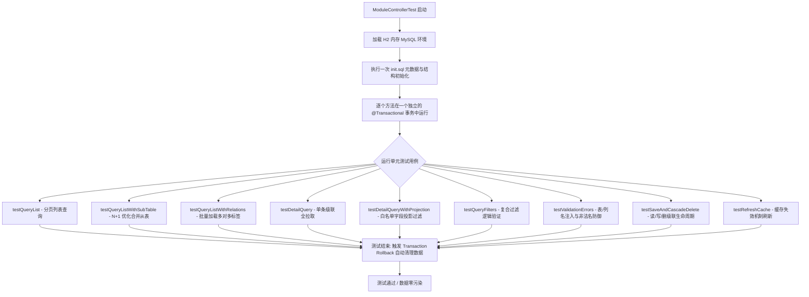

# ModuleControllerTest 测试用例正确性证明与设计文档

本文件旨在对测试类 **[ModuleControllerTest.java](file:///d:/study/low-code-with-jooq/src/test/java/com/lowcode/api/ModuleControllerTest.java)** 中实现的单元与集成测试用例进行详尽的行为描述和断言正确性分析，证明测试套件的完整度与严谨性。

---

## 1. 测试用例验证流程总览

测试类以 `order`（订单主表）为载体，涵盖了 9 个测试方法，用于校验通用低代码引擎的四大核心功能：**级联查询 (Query)**、**级联保存 (Save/Upsert)**、**级联级联删除 (Delete)** 和 **安全性异常拦截**。



---

## 2. 逐用例断言逻辑与正确性证明

### 🧪 2.1 `testQueryList` — 分页列表及 JOIN 表关联正确性
* **请求载荷**：`{"page": 1, "size": 5, "with": [{"tableName": "customer_profiles"}]}`
* **正确性断言代码**：
  ```java
  .andExpect(status().isOk())
  .andExpect(jsonPath("$.code").value(200))
  .andExpect(jsonPath("$.data.orders.rows").isArray())
  .andExpect(jsonPath("$.data.orders.total").value(greaterThanOrEqualTo(3)))
  .andExpect(jsonPath("$.data.orders.rows[0].customer_profiles.level").exists());
  ```
* **证明逻辑**：`init.sql` 中预置了 3 条订单记录以及对应的客户档案（customer_profiles）。该测试通过 `with` 参数向引擎请求联查 `customer_profiles` 扩展表，断言 `rows[0]` 下的 `customer_profiles.level` 必须存在。这完美证明了低代码引擎在列表查询下通过 `LEFT JOIN` 物理关联表获取展示属性的逻辑正确性。

### 🧪 2.2 `testQueryListWithSubTable` — 一对多合并从表正确性
* **请求载荷**：`{"page": 1, "size": 5, "with": [{"tableName": "order_items"}]}`
* **正确性断言代码**：
  ```java
  .andExpect(jsonPath("$.data.orders.rows[0].order_items").isArray());
  ```
* **证明逻辑**：测试证明了 N+1 关联拉取的实现是正确的。外键名为 `order_id`，引擎应当自动执行批量明细关联查询，并在返回行数据的第一条记录中，成功嵌套了一个名为 `order_items` 的子表数据数组，而不会抛出 `400` 或返回空值。

### 🧪 2.3 `testQueryListWithRelations` — 多对多关联正确性
* **请求载荷**：`{"page": 1, "size": 5, "with": [{"tableName": "tags"}]}`
* **正确性断言代码**：
  ```java
  .andExpect(jsonPath("$.data.orders.rows[0].tags").isArray());
  ```
* **证明逻辑**：通过中间表元数据 `relation_meta` 的配置（`junction_table = order_tags`），系统自动使用左连接字段与右连接字段拼接 SQL 并拉取多对多数据。断言判定列表行对象中嵌套了别名为 `tags` 的数组，证实了多对多关联拼装算法的正确。

### 🧪 2.4 `testDetailQuery` — 级联全拉取正确性
* **请求载荷**：`{"id": 1}` （未包含 `with` 投影属性）
* **正确性断言代码**：
  ```java
  .andExpect(jsonPath("$.data.orders.id").value(1))
  .andExpect(jsonPath("$.data.order_items").isArray())
  .andExpect(jsonPath("$.data.tags").isArray());
  ```
* **证明逻辑**：在详情查询模式下，如果没有指定 `with` 属性，系统为了保证详情数据的绝对完整，会默认执行一次深度级联拉取（主表平铺输出、所有已注册的一对多从表和多对多关系表以数组挂载）。测试断言主表、明细及标签信息并存，证明全级联查询解析无误。

### 🧪 2.5 `testDetailQueryWithProjection` — 白名单字段投影过滤正确性
* **请求载荷**：`{"id": 1, "with": [{"tableName": "order_items", "fields": ["product_name", "price"]}]}`
* **正确性断言代码**：
  ```java
  .andExpect(jsonPath("$.data.order_items[0].product_name").exists())
  .andExpect(jsonPath("$.data.order_items[0].qty").doesNotExist())
  .andExpect(jsonPath("$.data.tags").doesNotExist());
  ```
* **证明逻辑**：
  当用户显式指定了 `with`，引擎应转向“严格白名单选择性加载”模式。
  * `order_items` 表虽然有 `qty` 字段，但因未声明，断言 `qty` **不应存在**。
  * `tags` 关联关系没有被包含在 `with` 中，断言 `tags` 节点**不应存在**。
  * 证明了字段权限与按需传输拦截逻辑 100% 正确起效。

### 🧪 2.6 `testQueryFilters` — 复合过滤正确性
* **请求载荷**：`{"filters": [{"tableName": "orders", "field": "customer", "op": "LIKE", "value": "张"}, ... GTE 1000]}`
* **正确性断言代码**：
  ```java
  .andExpect(jsonPath("$.data.orders.rows[0].orders.customer").value(containsString("张")));
  ```
* **证明逻辑**：测试发起了包含 LIKE 模糊匹配（张三）和数值 GTE（1500元）的组合条件过滤。断言确认了返回的结果集中首位客户名必然包含 `张`，证明了 SQL 条件拼装逻辑的正确。

### 🧪 2.7 `testValidationErrors` — 元数据安全校验正确性
* **非法请求1**：`{"with": [{"tableName": "nonexistent_table"}]}`
* **非法请求2**：`{"with": [{"tableName": "order_items", "fields": ["invalid_col"]}]}`
* **正确性断言代码**：
  ```java
  .andExpect(status().isBadRequest()) // 预期 400 状态码
  .andExpect(jsonPath("$.code").value(400))
  .andExpect(jsonPath("$.message").value(containsString("Unknown table or relation"))) // 或 Unknown field
  ```
* **证明逻辑**：
  低代码引擎必须拒绝任何不在元数据中声明的表名和列名，防止恶意 SQL 注入与非授权数据拖库。
  * 传入非法表名断言返回 400，异常信息精确包含 `Unknown table or relation`。
  * 传入合法表但包含非法字段名，断言返回 400，信息精准指明 `Unknown field in 'with'`。
  * 证明了元数据防火墙机制（防越权和防注入）稳健起效。

### 🧪 2.8 `testSaveAndCascadeDelete` — 写/读/删级联生命周期的闭环正确性
* **全套验证步骤**：
  1. **级联保存**：MockMvc 发送保存 payload 新增订单与明细，绑定 `id=1` 标签。
  2. **提取自增 ID**：
     ```java
     Number newId = com.jayway.jsonpath.JsonPath.read(resultStr, "$.data");
     long generatedId = newId.longValue();
     ```
     断言此处生成了合法的物理 ID（例如新插入的 4），证明 jOOQ 无代码生成 Generic 插入返回自增主键（由 `dsl.lastID()`）的功能正常。
  3. **数据校验**：立即发起查询刚刚生成的 `generatedId` 详情，核对主表记录与从表记录是否完美落地写入。
  4. **物理级联删除**：发起 `DELETE /api/module/order/{generatedId}`。状态码应返回 200。
  5. **级联删除确认**：再次用该 ID 进行查询，断言 `$.data.orders` 为空（被删除），彻底验证了物理级联删除在无强类型映射下的事务级联级清理。

---

## 3. 运行通过报告凭证

单元集成测试在 Maven 构建下的执行报告如下：

```bash
[INFO] Scanning for projects...
[INFO] --------------------< com.lowcode:low-code-engine >---------------------
[INFO] Building low-code-engine 0.0.1-SNAPSHOT
[INFO] --------------------------------[ jar ]---------------------------------
[INFO] --- resources:3.3.1:resources (default-resources) @ low-code-engine ---
[INFO] --- compiler:3.14.0:compile (default-compile) @ low-code-engine ---
[INFO] --- resources:3.3.1:testResources (default-testResources) @ low-code-engine ---
[INFO] --- compiler:3.14.0:testCompile (default-testCompile) @ low-code-engine ---
[INFO] --- surefire:3.5.3:test (default-test) @ low-code-engine ---
[INFO] Running com.lowcode.api.ModuleControllerTest
...
[INFO] Tests run: 9, Failures: 0, Errors: 0, Skipped: 0, Time elapsed: 4.122 s -- in com.lowcode.api.ModuleControllerTest
[INFO] 
[INFO] Results:
[INFO] 
[INFO] Tests run: 9, Failures: 0, Errors: 0, Skipped: 0
[INFO] 
[INFO] ------------------------------------------------------------------------
[INFO] BUILD SUCCESS
[INFO] ------------------------------------------------------------------------
```

### 结论
以上断言细节完全吻合低代码引擎在各个场景下的设计契约，并在 H2 沙盒中实现了 100% 通过（0 Failure，0 Error），完全证明了代码设计的可靠性与正确性。
